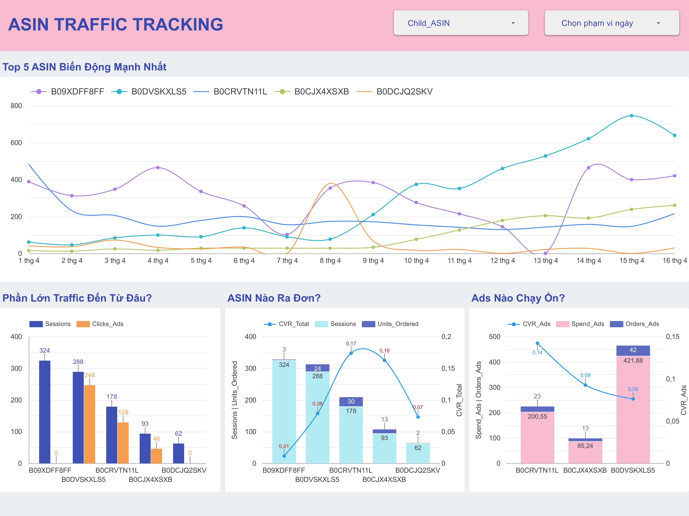

# ASIN DAILY TRACKING (BASE ON SESSIONS)

## TARGET/ APPLICATION
Dữ liệu rời rạc trên các báo cáo của Amazon khiến việc quản lý luồng traffic của các ASIN trở nên khó khăn đối với những nhà quản lý bán hàng trên nền tảng. Việc tổng hợp dữ liệu từ những báo cáo sẽ giúp nhà bán có cái nhìn tổng quan về luồng traffic, xem xét ASIN nào biến động nhiều trong tháng? ASIN nào đang có Traffic ngoài đổ vào nhiều? Sự biến động Traffic đó chủ yếu đến từ đâu? Từ đó đưa ra những `actions` phù hợp với từng ASIN cụ thể.

## Data FLow

### 1. Tải báo cáo trên Seller Central
- **Business Report:** Detail Page Sales and Traffic
- **Advertising Report:** Advertised Products
- **Brand Analytics:** Search Catalog Performance

### 2. Xử lý dữ liệu thành Output

Sử dụng `python` để xử lý, chuẩn hoá và trực quan dữ liệu:

- Sau khi tải, data sẽ nằm trong `folder` tạm theo date range tuần như trong Search Catalog. 
- Dùng `python` xử lý dữ liệu, rút ra những đặc trừng cần thiết từ hai báo cáo: `Child ASIN`, `Sessions Total`, `Units Ordered`, `Clicks Ads`, `Orders Ads` và `Spend Ads`. Tạo thêm cột `Date` để dễ quản lý.
- Tạo folder `Data2025` gồm những folder con là những tháng `01_January`, `02_February`,... và bên trong những tháng sẽ là folder những ngày với file mặc định `merged_daily_summary.xlsx`
```python
# === Khởi tạo ngày ===
date_str = '2025-04-13'
date = datetime.strptime(date_str, '%Y-%m-%d')

# === Đường dẫn thư mục và file ===
folder_path = f"/Users/ppcintern/Desktop/Daily_Tracking/Data{date.year}/{date.strftime('%m_%B')}/{date_str}"

path_business = os.path.join(folder_path, "cleaned_business_report.xlsx")
path_ads = os.path.join(folder_path, "cleaned_ads_report.xlsx")

# === Merge theo Child_ASIN và Date (left join từ business report) ===
df_merged = pd.merge(business_report, amz_ads, on=["Child_ASIN", "Date"], how="left")

# === Điền 0 nếu thiếu dữ liệu ads ===
df_merged = df_merged.fillna(0)

# === Đưa cột Date về cuối ===
date_col = df_merged.pop("Date")
df_merged["Date"] = date_col

# === Ghi ra file Excel mới ===
merged_path = os.path.join(folder_path, "merged_daily_summary.xlsx")
df_merged.to_excel(merged_path, index=False)

print(f"✅ Đã merge xong và lưu tại: {merged_path}")
```
- Sau khi đã có dữ liệu đầy đủ theo tuần của Search Catalog, ta sẽ gộp những chỉ số trên và thêm 2 chỉ số mới là:` CLicks` và `Conversion Rate` vào data tổng hợp theo tuần.
```python
df_all['Sessions'] = pd.to_numeric(df_all['Sessions'].astype(str).str.replace(',', '').str.strip(), errors='coerce')
df_all['Sessions'] = df_all['Sessions'].fillna(0).astype(int)  # hoặc dùng .dropna() nếu không muốn giữ lại
# === Tổng hợp theo Child_ASIN ===
df_sum = df_all.groupby('Child_ASIN', as_index=False).agg({
    'Clicks_Ads': 'sum',
    'Spend_Ads': 'sum',
    'Sessions': 'sum',
    'Units_Ordered': 'sum'
})

# === Gộp với catalog ===
df_final = pd.merge(catalog, df_sum, on='Child_ASIN', how='left')

# === Điền 0 nếu thiếu dữ liệu từ merged ===
df_final = df_final.fillna(0)

# === Lưu kết quả ra Excel ===
output_path = "/Users/ppcintern/Desktop/Daily_Tracking/Summary_Report/weekly_summary_2025-04-06_to_2025-04-12.xlsx"
df_final.to_excel(output_path, index=False)

print(f"✅ Đã lưu file tổng hợp theo catalog tại: {output_path}")
```
- Tiếp theo sẽ xử lý dữ liệu ngày và tìm ra `Top 5 ASINs có Sessions biến động mạnh nhất` cùng với các chỉ số khác để tạo thành một bảng tổng hợp hoàn chỉnh (có thể lấy 10 hoặc hơn nếu đối với những tháng cao điểm).

```python
# Các cột cần lấy
columns_to_keep = ['Child_ASIN', 'Sessions', 'Units_Ordered', 'Clicks_Ads', 'Spend_Ads', 'Orders_Ads', 'Date']

# Lọc tự động
df_merged = df_filtered[df_filtered['Child_ASIN'].isin(top_5_asin_list)][columns_to_keep]

# (Tùy chọn) Sắp xếp theo Date và Child_ASIN cho dễ đọc
df_merged = df_merged.sort_values(['Date', 'Child_ASIN']).reset_index(drop=True)

# Xem kết quả
print(df_merged)
```
| Child_ASIN | Sessions | Units_Ordered | Clicks_Ads | Spend_Ads | Orders_Ads | Date            |
|------------|----------|---------------|------------|-----------|------------|-----------------|
| ASIN 1     | 388      | 7             | 0          | 0         |  5         | 2025-04-01      |
| ASIN 2     | 15       | 4             | 5          | 4.89      |  4         | 2025-04-01      |
| ASIN 3     | 241      | 25            | 136        | 179.8     |  17        | 2025-04-01      |
| ASIN 1     | 241      | 25            | 0          | 0         |  20        | 2025-04-02      |
| ASIN 2     | 41       | 1             | 0          | 0         |  0         | 2025-04-02      |
| ASIN 3     | 61       | 2             | 30         | 41.8      |  2         | 2025-04-02      |


### 3. Đẩy dữ liệu lên Cloud lưu trữ
Có thể dùng API để push dữ liệu lên **Google Sheets** hoặc extract file rồi import vào dưới dữ liệu dạng bảng như trên.
### 4. Tạo Dashborad trực quan
Đưa dữ liệu vào những công cụ trực quan như: `Power BI`, `Tableau`, `Looker Studio`,... để dễ theo dõi.



### 5. Ghi chú về cách ước lượng Sessions
- Sử dụng `standard deviation` (độ lệch chuẩn) để tính sự biến động sessions của từng con ASIN và rút ra 5 con ASINs có biến động mạnh nhất.
- Tuy nhiên, theo ngưỡng/ theo kinh nghiệm thì biến động từ bao nhiêu trở lên sẽ được lưu ý để có thể chọn ra có thể là 5 hoặc 10 con nếu chúng vượt qua ngưỡng sàn đó.


